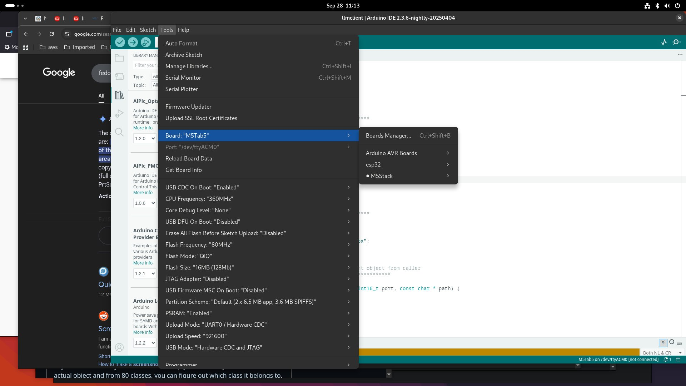
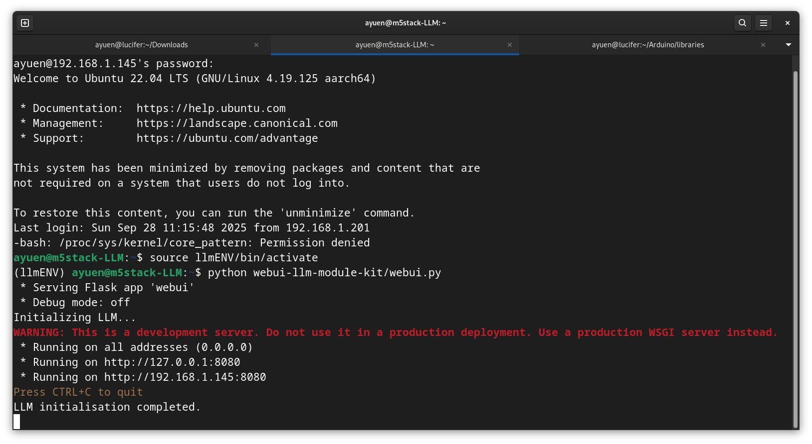
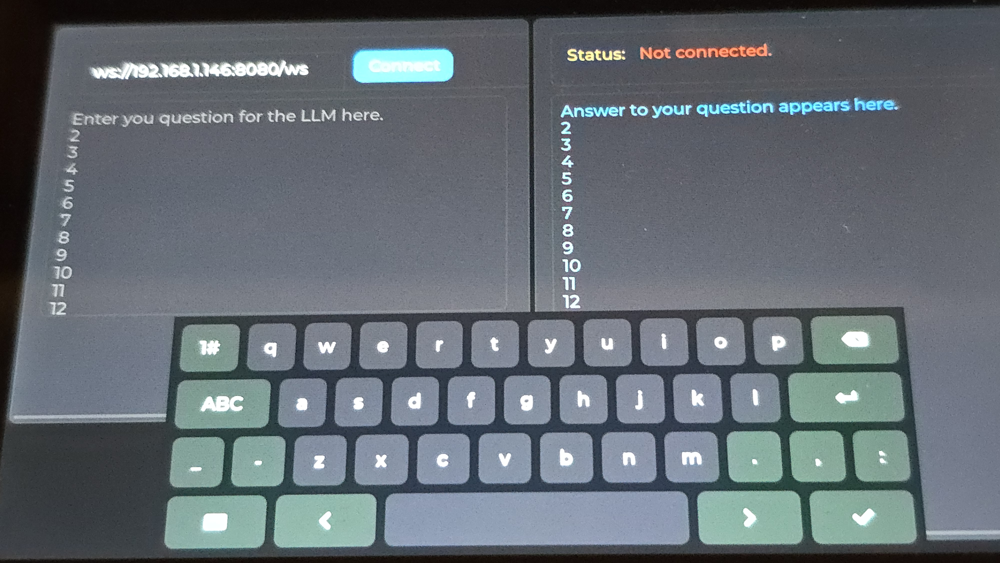
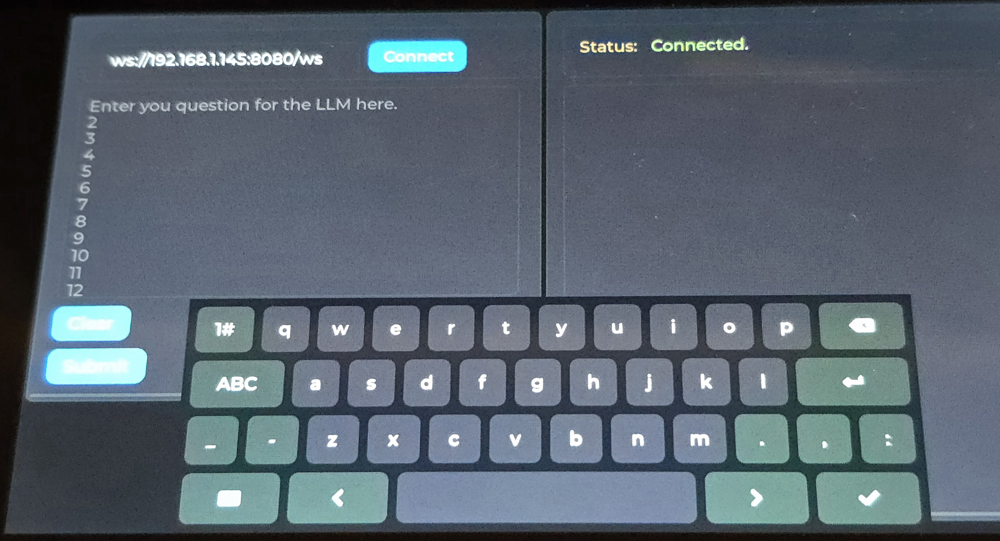
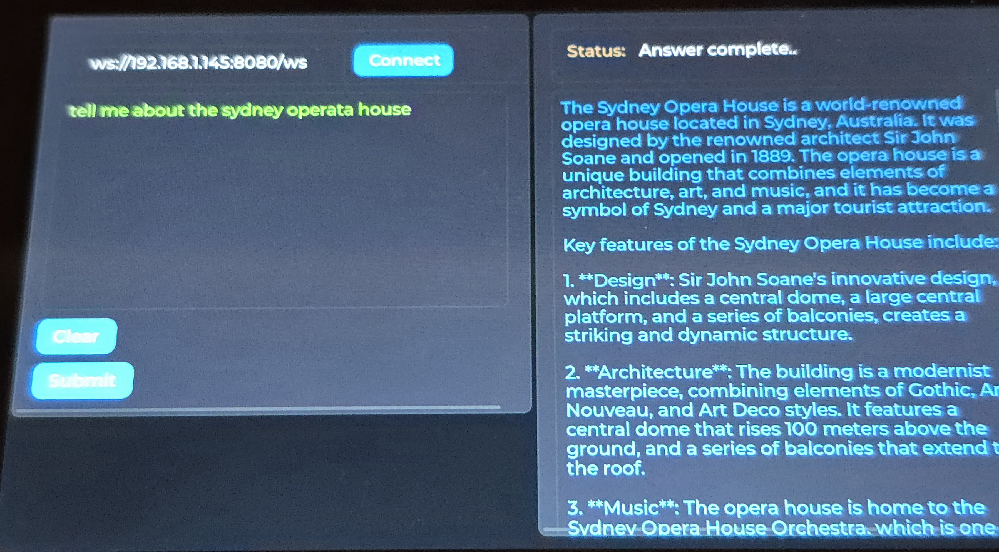

# Project: A M5Stack Tab5 LVGL-based LLM Client
I handcrafted a [lvgl](https://docs.lvgl.io/8.3/intro/index.html) (Light and Versatile Graphics Library) GUI using lvgl layout and a number of core widgets including a touch keyboard for the [M5Stack Tab5](https://shop.m5stack.com/products/m5stack-tab5-iot-development-kit-esp32-p4). I also used a websocket to interact with a LLM via my python server running on the [M5Stack LLM Module Kit](https://shop.m5stack.com/products/m5stack-llm-large-language-model-module-kit-ax630c).

## 1. How this Project Came About?
The M5Stack Tab5 looks is an interesting piece of hardware. I purchased one thinking that it will be fun to program it. After I purchased it, I quickly realise that using the graphics library [M5GFX](https://docs.m5stack.com/en/arduino/m5gfx/m5gfx_functions) alone is not going to cut it. I have to learn lvgl to create a usable GUI. I discovered that there aren't many Tab5 examples on the Internet to learn from. The examples I found all use a UI editor eg,[SquareLine Studio](https://squareline.io/), [LVGL Editor](https://lvgl.io/editor), etc., to create the user interface. And all they do is showing some widgets on the screen that are not functional, in other words, without a purpose. I want to start from basics to learn how to use lvgl on the Tab5 to do something useful. 
  Sometime ago, I published a project ([webui-llm-module-kit](https://github.com/AndyYuen/webui-llm-module-kit)) on Github which creates a python server running on the M5Stack LLM Module Kit to provide a web interface to interact with a LLM using websockets. I think it will be fun and instructional to create a GUI on Tab5 to do the same. Of course, Tab5 does not have a web browser. The solution is to use lvgl to create a GUI that can interact with the python server using websocket without having to change the python server at all. Just like that, this project was born. I want to learn the lvgl basics and not use any UI editors. And I want to develop it using Arduino.

## 2. Prerequisites
### 2.1 Hardware
1. A M5Stack Tab5
2. A M5Stack LLM Module Kit (no M5Stack controllers needed)

### 2.2 Development Environment
I assume that you are already familiar with the Arduino IDE and using it to compile/upload an application to your device. If not, refer to this [document](https://docs.m5stack.com/en/arduino/m5tab5/program) to get started. 

1. The Arduino IDE with the following installed:
* arduino-ide_nightly-20250404_Linux_64bit (or newer)
* Boards Manager: M5Stack 3.2.2
* Arduino libraries:

    | Library     | Version |
    |-------------|---------|
    | Arduinojson | 7.4.2   |
    | lvgl        | 8.3.0   |
    | M5GFX       | 0.2.8   |
    | WebSockets  | 2.7.0   |

* Arduino Tools settings:

    | Item             | Setting               |
    |------------------|-----------------------|
    | Board            | M5Tab5                |
    | USB CDC on boot  | disabled              |
    | Flash Size       | 16MB (128Mb)          |
    | Partition Scheme | Default               |
    | PSRAM            | Enabled               |
    | Upload Mode      | UART0 / Hardware CDC  |
    | USB Mode         | Hardware CDC and JTAG |

Here is a screenshot of the selected options:

* special lvgl setup
    1. change to the arduino libraries/lvgl directory
    2. cp -r examples src/
    3. cp lv_conf_template.h ../lv_conf.h
    4. edit ../lv_config.h
     Add the 3 #define statements:

<pre>
/*====================
   COLOR SETTINGS
 *====================*/

/** Color depth: 1 (I1), 8 (L8), 16 (RGB565), 24 (RGB888), 32 (XRGB8888) */
#define LV_COLOR_DEPTH 16
#define LV_COLOR_16_SWAP 1
#define LV_TICK_CUSTOM 1

</pre>

Change #define LV_FONT_MONTSERRAT_22 to 1 and all other #define LV_FONT_MONTSERRAT_NN settings to 0

<pre>
/*==================
 *   FONT USAGE
 *===================*/

/* Montserrat fonts with ASCII range and some symbols using bpp = 4
 * https://fonts.google.com/specimen/Montserrat */
#define LV_FONT_MONTSERRAT_8  0 
#define LV_FONT_MONTSERRAT_10 0
#define LV_FONT_MONTSERRAT_12 0
#define LV_FONT_MONTSERRAT_14 0
#define LV_FONT_MONTSERRAT_16 0
#define LV_FONT_MONTSERRAT_18 0
#define LV_FONT_MONTSERRAT_20 0
#define LV_FONT_MONTSERRAT_22 1
#define LV_FONT_MONTSERRAT_24 0
...
</pre>

Now you are ready to compile and upload the application to your Tab5. 
  <B><I>Before you do, remember to change the ssid and password in "llmclient.ino" to match those for your WIFI.</I></B>

## 3. Running the llmclient Application
### 3.1 Starting the python server on the LLM Module Kit
I set up a normal user on the LLM Module Kit to avoid using root to run the server. You can either do the same or run the server as root for a quick test.
  ssh into your LLM Module Kit
<pre>
# clone my repo
git clone https://github.com/AndyYuen/webui-llm-module-kit.git
cd webui-llm-module-kit

# install/setup a virtual environment
pip install virtualenv
python -m virtualenv llmENV
source llmENV/bin/activate

pip install -r requirements.txt

# start the server
python webui.py

</pre>
Point your web browser to:
<pre>
http://LLM-Kit-IPAddress:8080
</pre>
to interact with the LLM and compare the experience to that of using the Tab5 in the next step.

### 3.2 Running the llmclient
The llmclient UI on Tab5 is shown below:

* to connect to the python server websocket, enter the ws-URI for the websocket next to the 'Connect" Button:
<pre>
ws://llmIPAddress:port/path

# The default port and path for the llm python server are 8080 and /ws respectivey. For my LLM Module Kit, it is:

ws://192.168.1.145:8080/ws
</pre>

When you power up the Tab5, it connects to the WIFI before displaying the UI. Sometimes, it may take a few seconds.
  Some syntax checking of the ws-URI entered is performed when you click on the "Connect" button. The checks include missing "ws://", llmIPAddress, port number and path ("/ws"). If everything checks OK, it connects to the python server using a websocket.
* the status is shown near the top right-hand-side
* once the websocket is connected, the "Clear" and "Submit" buttons appear near the botton left-hand-side. 

* you can change the ws-URI and click "Connect" to connect to another LLM Module Kit websocket if you have more that one LLM Module Kit.
* you can enter your question for the LLM in the input textarea (on the left) and click the "Submit" button to send your question to the LLM via the python server.
* the "Clear" and "Submit" buttons disappear until the response from the LLM is complete.

* the keyboard, if not present, will apear when you touch either the ws-URI or question input textareas
* and it will disappear when you touch outside the input textareas.
* you can click the "Clear" button to clear the question and answer textareas.

## 4. Conclusions
In this project, I provided you with the source code, instructions to build a lvgl-based LLM client to run on the Tab5 without using a UI editor such as SquareLine Studio. I handcrafted the GUI using lvgl layout and a number of core widgets. I also illustrated how to use a websocket to interact with a LLM via my python server running on the LLM Module Kit. I hope you will enjoy this project like I did. You can potentially use this project as a template for building your own Tab5 lvgl application. If you do, please let me know about your project as I am interested in how others are using the Tab5.

Enjoy!